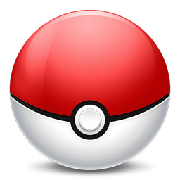

#  Charizard

***

_`Spits fire that is hot enough to melt boulders. Known to cause forest fires unintentionally.`_

***

## Type

Fire|Flying
:---:|:---:
 |  

## Evolution

Charmander|Charmeleon|Charizard
:---:|:---:|:---:
 |  |  

stats|Charmander|Charmeleon|Charizard
:---:|:---:|:---:|:---:
hp|0|0|0
attack|0|0|0
defense|0|0|0
sp.attack|0|0|0
sp.defense|0|0|0

